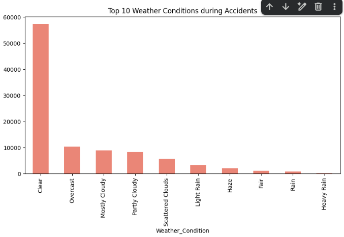
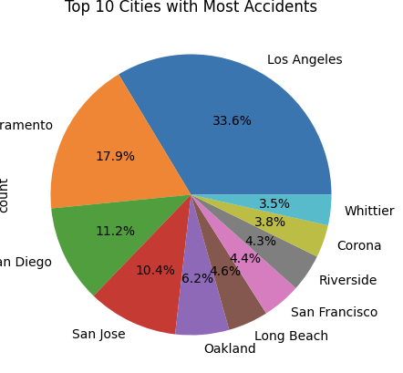

# US Accident Exploratory Data Analysis - Task 05

## Project Overview
Is project mein maine US Accidents dataset (2016-2023) ka use karke accident patterns ko analyze kiya hai. Maine Python aur libraries jaise Pandas, Matplotlib, aur Seaborn ka use karke visualizations banaye hain.

## Dataset
Dataset Source: [Kaggle US Accidents Dataset](https://www.kaggle.com/datasets/sobhanmoosavi/us-accidents)
*Note: Dataset file size is 2.85 GB, isliye ise repository mein upload nahi kiya gaya hai.*

## Key Insights from Analysis
Maine analysis ke dauran ye patterns notice kiye:
1. **Weather Impact:** Sabse zyada accidents 'Clear' aur 'Overcast' mausam mein record huye hain.
2. **City Hotspots:** Los Angeles (33.6%) accidents ke maamle mein sabse bada hotspot hai, uske baad Sacramento (17.9%) ka number aata hai.
3. **Time Analysis:** Accidents ka distribution din ke alag-alag ghanton mein vary karta hai (Rush hours mein zyada risk dikhta hai).

## Visualizations

